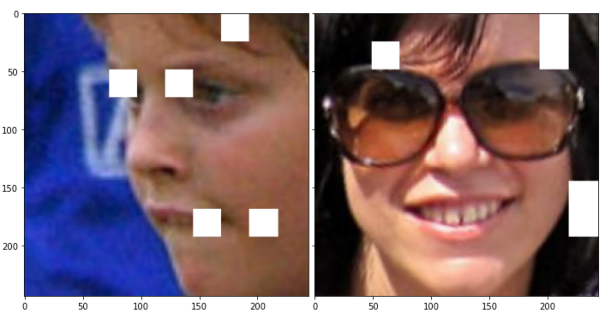

# 1. Title: How to build a scalable open source (Trusted AI) Visual Recognition pipeline with Elyra, TensorFlow and Kubernetes

# 2. Introduction
This article provides a entirely open source, reusable template for production grade computer vision (image classification and annotation) on top of Kubernetes. It is meant for data scientists, data engineers, and AI/data centric software engineers. You will learn how to use the [Cloud Annotations](https://github.com/cloud-annotations) tool, [Kubeflow Pipelines](https://kubeflow.org), the TrustedAI toolkits [AIF360](https://github.com/Trusted-AI/AIF360) and [AIX360](https://github.com/Trusted-AI/AIX360) on top of [Elyra](https://github.com/elyra-ai), making [Kubernetes](https://kubernetes.io/) as first class citizen of [JupyterLab](https://jupyter.org)

We visually create an AI pipeline with a set of jupyter notebooks. We cover two workflows. First, with your own image dataset and the Cloud Annotation tool you label your favorite images into categories, upload it to S3 cloud object store and have a ready made pipeline classify the images for you and deploy this visual recognition model as REST service to Kubernetes. Then, using the "Fairface" dataset we train and thenn asses the trained classification model on fairness metrics like bias using the open source AIF360 toolkit. We will detect if images from underprivileged group are experiencing reduced model performance. Finally, we use the AIX360 toolkit to highlight parts of the images which have been crucial for the classifiers decision.
    
    
# 3. Prerequisites

You need to have a local docker installation to run the Elyra/JupyterLab image we provide. You should be familiar with python and basic machine learning / deep learning. 

# 4. Estimated time
    30 minutes

# Understanding Annotations #TODO nick

## The Cloud Annotations tool #TODO nick

## Upload and annotate your images #TODO nick

# Environment Setup #TODO nick

## COS setup #TODO nick

## Elyra setup #TODO nick

## Kubeflow Pipelines setup #TODO romeo

# The standard image classification pipeline #TODO nick

## Introducing the Elyra Pipeline Editor #TODO nick

### Local Execution #TODO nick

### Execution on Kubeflow #TODO nick

# The TrustedAI image classicifation pipeline ##TODO romeo
In this section we ant to introduce you to TrustedAI with it's subcategories "Bias/Fairness detection", "Explainability" and "Adversarial Robustness".

## Bias/Fairness detection detection 
So what is bias? [Wikipedia](https://en.wikipedia.org/wiki/Bias) says: "Bias is a disproportionate weight in favor of or against an idea or thing, usually in a way that is closed-minded, prejudicial, or unfair." So here we have it? We want our model to be fair and unbiased towards protected attributes like gender, race, age, socioeconomic status, religion and so on. So wouldn't it be easy to just not "give" the model those data during training? It turns out that it isn't that simple. Protected attributes are often encoded in other attributes. For example, race, religion and socioeconomic status are latently encoded in attributes like zip code, contact method or types of products purchased. Going into more details would go beyond the scope of this article. Therefore we highly recommend to read through the supplementary materials at the end of this article.

## Explainability

Besides their stunning performance, deep learning models face a lot of resistance for production usage because they are considered as black box. Technically (and mathematically) deep learning models are a series of non-linear feature space transformations - sounds scary, but in other words, per definition it is very hard to understand the individual processing steps a deep learning network performs. But techniques exist to look over the deep earning model's shoulders.  The one we are using here is called [LIME](https://github.com/marcotcr/lime). LIME takes the existing classification model and permutes images taken from the validation set (therefore the real class label is known) as long as a misclassification is happening. That way LIME can be used to create heat maps as image overlays to indicate regions of images which are most relevant for the classifier to perform best. In other words, we identify regions of the image the classifier is looking at. 

As the following figure illustrates, the most relevant areas in an image for classifying gender are areas showing hair, eyes and mouth.

Again, going into more details would go beyond the scope of this article. Please read through the supplementary materials at the end of this article. 

## Adversarial Robustness
Adversarial Robustness is all about model stability. Somewhat related to LIME, it asks the question, how much of (adversarial) noise a model tolerates before a misclassification happens. So an adversarial poisoning training data before model training happens or somebody with "physical" access to the model parameters coming up with slightly modified input data to control the model in his or her favour. As the figure below illustrates by adding only slight traces of adversarial noise, the deep learning model misclassifies a stop sign as yield sign. 

TODO why is figure caption not rendered?

Now at the latest it should be clear that deep learning models see and understand data differently than humans and we have to make sure that we understand these models (and their limitations) as well as possible and make them robust against attacks of any kind.

## Understanding the fair faces dataset #TODO romeo

## Understanding bias #TODO romeo

## How can models be explained? #TODO romeo

# 5. Summary
    You've learned how to visually create, schedule and run production grade, open source machine learning pipelines on top of Kubeflow using an image classifier template.

# 6. Related links
- [Cloud Annotations](https://github.com/cloud-annotations)
- [Kubeflow Pipelines](https://kubeflow.org)
- [AIF360](https://github.com/Trusted-AI/AIF360)
- [AIX360](https://github.com/Trusted-AI/AIX360)
- [Elyra](https://github.com/elyra-ai)
- [Kubernetes](https://kubernetes.io/)
- [JupyterLab](https://jupyter.org)
