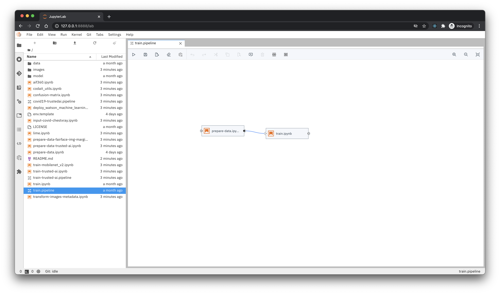
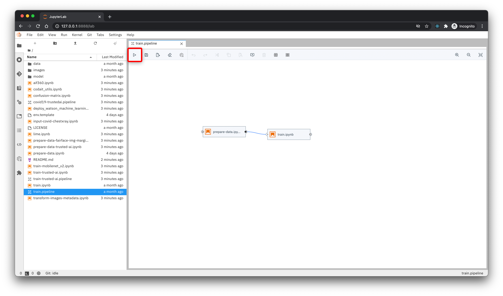
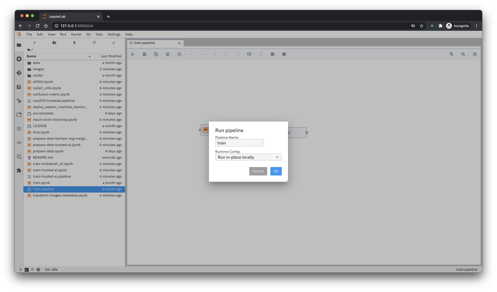
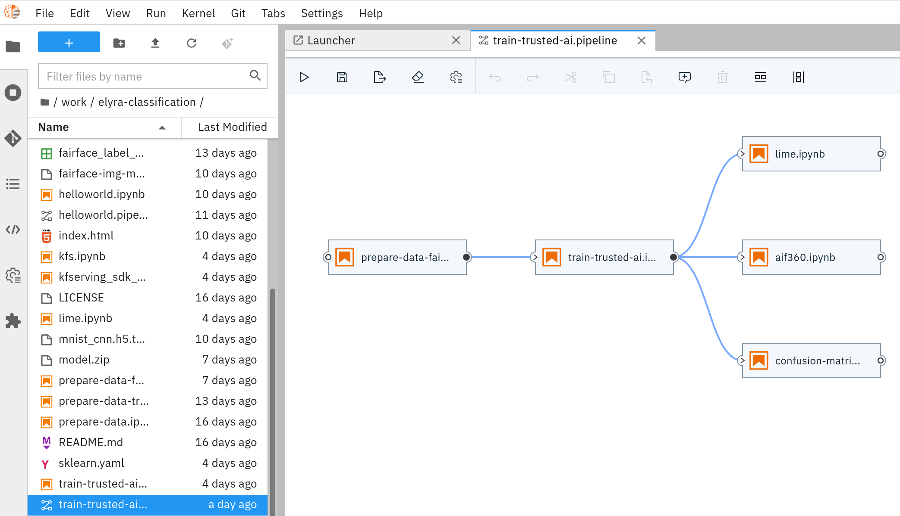
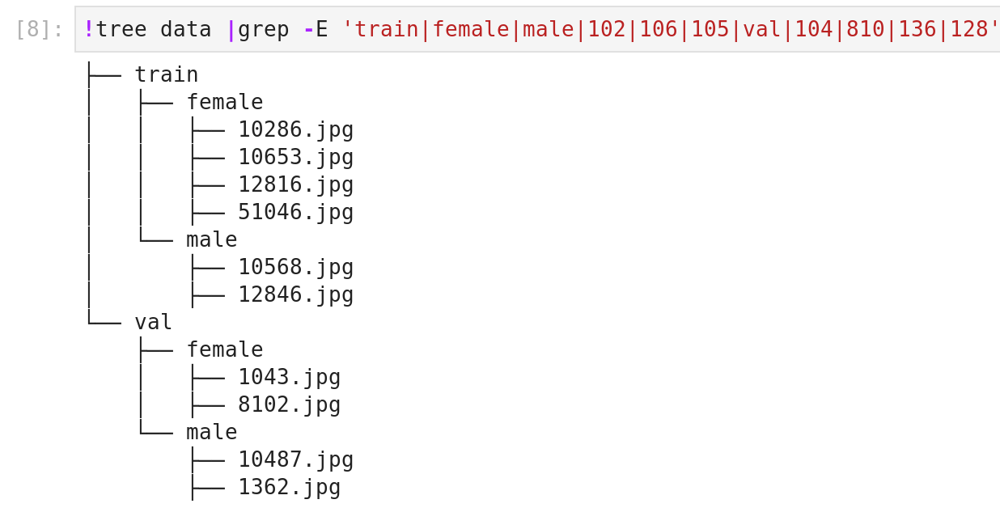
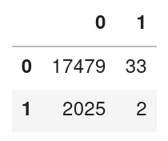
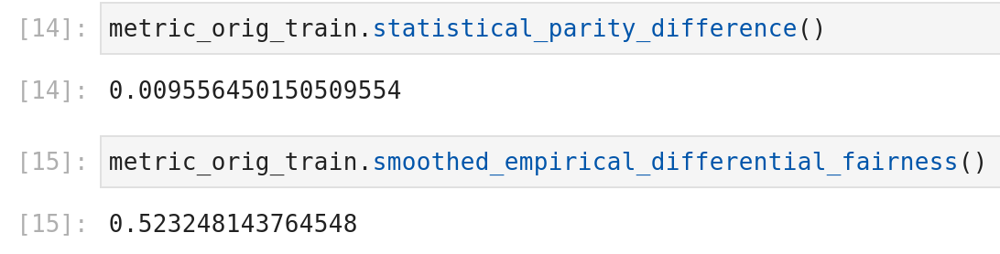

# 1. Title: How to build a scalable open source (Trusted AI) Visual Recognition pipeline with Elyra/Jupyter Lab, TensorFlow, Kubeflow and Kubernetes


# 2. Introduction
This article provides a entirely open source, reusable template for production grade computer vision (image classification and annotation) on top of Kubernetes. It is meant for data scientists, data engineers, and AI/data centric software engineers. You will learn how to use the [Cloud Annotations](https://github.com/cloud-annotations) tool, [Kubeflow Pipelines](https://kubeflow.org), the TrustedAI toolkits [AIF360](https://github.com/Trusted-AI/AIF360) and [AIX360](https://github.com/Trusted-AI/AIX360) on top of [Elyra](https://github.com/elyra-ai), making [Kubernetes](https://kubernetes.io/) as first class citizen of [JupyterLab](https://jupyter.org)

We visually create an AI pipeline with a set of jupyter notebooks. We cover two workflows. First, with your own image dataset and the Cloud Annotation tool you label your favorite images into categories, upload it to S3 cloud object store and have a ready made pipeline classify the images for you and deploy this visual recognition model as REST service to Kubernetes. Then, using the "Fairface" dataset we train and then assess the trained classification model on fairness metrics like bias using the open source AIF360 toolkit. We will detect if images from underprivileged group are experiencing reduced model performance. Finally, we use the AIX360 toolkit to highlight parts of the images which have been crucial for the classifiers decision.
    
    
# 3. Prerequisites

You need to have a local docker installation to run the Elyra/JupyterLab image we provide. You should be familiar with python and basic machine learning / deep learning. 

# 4. Estimated time
    30 minutes


# Preparing training data
In order to train a model to classify images, we need a dataset to teach it. We can use the Cloud Annotation tool to organize and label our images so that we can use them to train our own custom model.

## The Cloud Annotations tool
Cloud Annotations is built on top of IBM Cloud Object Storage. Using a cloud object storage offering provides a reliable place to store training data. It also opens up the potential for collaboration, letting a team to simultaneously annotate the dataset in real-time.

IBM Cloud offers a lite tier of object storage, which includes 25 GB of free storage.

Before you start, sign up for a free [IBM Cloud](https://ibm.biz/cloud-annotations-dashboard) account.

## Training data best practices
To train a computer vision model you need a lot of images.
Cloud Annotations supports uploading both photos and videos.
However, before you start snapping, there's a few limitations to consider.

- **Object Type** The model is optimized for photographs of objects in the real world. They are unlikely to work well for x-rays, hand drawings, scanned documents, receipts, etc.
- **Object Environment** The training data should be as close as possible to the data on which predictions are to be made. For example, if your use case involves blurry and low-resolution images (such as from a security camera), your training data should be composed of blurry, low-resolution images. In general, you should also consider providing multiple angles, resolutions, and backgrounds for your training images.
- **Difficulty** The model generally can't predict labels that humans can't assign. So, if a human can't be trained to assign labels by looking at the image for 1-2 seconds, the model likely can't be trained to do it either.
- **Label Count** We recommend at least 50 labels per object category for a usable model, but using 100s or 1000s would provide better results.
- **Image Dimensions** The model resizes the image to 300x300 pixels, so keep that in mind when training the model with images where one dimension is much longer than the other.
  
- **Object Size** The object of interests size should be at least ~5% of the image area to be detected. For example, on the resized 300x300 pixel image the object should cover ~60x60 pixels.
  

## Set up Cloud Annotations
To use Cloud Annotations just navigate to [cloud.annotations.ai](https://cloud.annotations.ai) and click **Continue with IBM Cloud**.


Once logged, if you don't have an object storage instance, it will prompt you to create one. Click **Get started** to be directed to IBM Cloud, where you can create a free object storage instance.


You might need to re-login to IBM Cloud to create a resource.


Choose a pricing plan and click **Create**, then **Confirm** on the following popup.


Once your object storage instance has been provisioned, navigate back to [cloud.annotations.ai](https://cloud.annotations.ai) and refresh the page.

The files and annotations will be stored in a **bucket**, You can create one by clicking **Start a new project**.


Give the bucket a unique name.


After your bucket is created and named, it will prompt you to choose an annotation type. Choose `Classification`.


## Labeling the data
1. Create the desired labels
   
2. Upload images
   
3. Select images then choose `Label` > `DESIRED_LABEL`
   

# Training a model
After we have collected and labeled our first round of images, we are ready to start training our model!

## Elyra
Building an AI pipeline for a model is hard, breaking down and modularizing a pipeline is harder. A typical machine/deep learning pipeline begins as a series of preprocessing steps followed by experimentation/optimization and finally deployment. Each of these steps represent a challenge in the model development lifecycle.

Elyra provides a Pipeline Visual Editor for building AI pipelines from notebooks and Python scripts, simplifying the conversion of multiple notebooks or Python scripts into batch jobs or workflows.

Currently, pipelines can be executed locally in JupyterLab or on Kubeflow Pipelines.

## Set up Elyra
We will be using Elyra to train our image recognition model. Elyra is an extension to JupyterLab, so in order to use Elyra we first need to install `jupyterlab`:
```
pip install jupyterlab
```

We can can then install `elyra` and build JupyterLab
```
pip install elyra && jupyter lab build
```
Alternatively, the following command will bring up a ready made container on docker

```
docker run -it -p 8888:8888 -v elyra_work:/home/jovyan/work elyra/elyra:latest  jupyter-lab
```

## The standard image classification pipeline 
We have provided an Elyra Pipeline for training a basic classification model. The model we will be training is the MobileNet architecture. MobileNet models have a very small file size and can execute very quickly with compromising little accuracy, which makes it perfect for running on mobile devices or in the browser.

When we say we are training the model, we are technically re-training the model. The model we are training has already been trained on millions of image and thousands of categories ranging from ducks to airplanes. This helps teach the model ideas like basic edges and shapes, letting us train it on the things we care about with little training data.

`git clone` the repo and `cd` into it by running the following command:
```
git clone https://github.com/cloud-annotations/elyra-classification.git
cd elyra-classification
```

You should see a file named `env.template`. This file needs to be updated with your IBM Cloud Object Storage credentials. Once you've updated it, rename the file to `.env`:
```
BUCKET=<your-bucket-name>
ACCESS_KEY_ID=<your-key-id>
SECRET_ACCESS_KEY=<your-key-secret>
ENDPOINT_URL=https://<public-cos-endpoint>
```

Start JupyterLab and open `train.pipeline`:
```
jupyter lab
```

You should see a simple pipeline that looks something like this:



## Local Execution
Later, we will show you how to set up and run your pipeline on Kubeflow, but for now we can test that our pipeline is working by running locally.

We can run our pipeline locally by clicking the run button:


Then choose `Run in-place locally`:


The pipeline should take a few minutes to execute locally. Once finished, if your training was successful, you should see a `model` folder with a `saved_model.pb` inside it.


## Kubeflow Pipelines setup #TODO romeo

## Execution on Kubeflow #TODO romeo


# The TrustedAI image classification pipeline ##TODO romeo
In this section we ant to introduce you to TrustedAI with it's subcategories "Bias/Fairness detection", "Explainability" and "Adversarial Robustness".

## Bias/Fairness detection detection 
So what is bias? [Wikipedia](https://en.wikipedia.org/wiki/Bias) says: "Bias is a disproportionate weight in favor of or against an idea or thing, usually in a way that is closed-minded, prejudicial, or unfair." So here we have it? We want our model to be fair and unbiased towards protected attributes like gender, race, age, socioeconomic status, religion and so on. So wouldn't it be easy to just not "give" the model those data during training? It turns out that it isn't that simple. Protected attributes are often encoded in other attributes. For example, race, religion and socioeconomic status are latently encoded in attributes like zip code, contact method or types of products purchased. Going into more details would go beyond the scope of this article. Therefore we highly recommend to read through the supplementary materials at the end of this article.

## Explainability

Besides their stunning performance, deep learning models face a lot of resistance for production usage because they are considered as black box. Technically (and mathematically) deep learning models are a series of non-linear feature space transformations - sounds scary, but in other words, per definition it is very hard to understand the individual processing steps a deep learning network performs. But techniques exist to look over the deep earning model's shoulders.  The one we are using here is called [LIME](https://github.com/marcotcr/lime). LIME takes the existing classification model and permutes images taken from the validation set (therefore the real class label is known) as long as a misclassification is happening. That way LIME can be used to create heat maps as image overlays to indicate regions of images which are most relevant for the classifier to perform best. In other words, we identify regions of the image the classifier is looking at. 

As the following figure illustrates, the most relevant areas in an image for classifying for COVID-19 are areas containing bones over lung tissue which indicates for problem.


Again, going into more details would go beyond the scope of this article. Please read through the supplementary materials at the end of this article. 

## Adversarial Robustness
Adversarial Robustness is all about model stability. Somewhat related to LIME, it asks the question, how much of (adversarial) noise a model tolerates before a misclassification happens. So an adversarial poisoning training data before model training happens or somebody with "physical" access to the model parameters coming up with slightly modified input data to control the model in his or her favour. As the figure below illustrates by adding only slight traces of adversarial noise, the deep learning model misclassifies a stop sign as yield sign. 

TODO why is figure caption not rendered?


Now at the latest it should be clear that deep learning models see and understand data differently than humans and we have to make sure that we understand these models (and their limitations) as well as possible and make them robust against attacks of any kind.

## Understanding the fair faces dataset
Image datasets containing (gender) labeled faces are usually biased towards the caucasian race. The researchers at the University of California in Los Angeles created an open dataset published under the Creative Commons License [CC BY 4.0](https://creativecommons.org/licenses/by/4.0/) containing 108,501 balanced over seven race groups. Besides the dataset they've also released a deep learning classifier but we're creating one on our own. You can find out more about this project [here](https://openaccess.thecvf.com/content/WACV2021/papers/Karkkainen_FairFace_Face_Attribute_Dataset_for_Balanced_Race_Gender_and_Age_WACV_2021_paper.pdf) and get access to the data and code [here](https://github.com/joojs/fairface).

# The TrustedAI image classification pipeline
As already mentioned previously, pipelines are a great way to introduce reproducibility, scaling, auditability and collaboration in machine learning. Pipelines are often a central part of a ML-Ops strategy. This especially holds for TrustedAI pipelines since reproducibility and auditability are even more important there. The following figure illustrates the TrustedAI pipeline.



In the following we'll walk you through the different pipeline steps and associated code snippets worth having a closer look at.

## Data Preparation
In this particular case, we're not pulling Cloud Annotations export data from a S3/Cloud Object Store as before but directly access it from a Cloud Object Store via a public and permanent link. As described before, the the de-facto standard for labeled image data is putting images into one folder per class/category. But in this particular case, the raw data isn't in the required format. It's just a folder full of images and their properties are described in a separate CSV file. In addition to the class (or label) - gender in this case -  this CSV file also contains information on the race and age group. So first, we just use the information on the gender label given in the CSV file and arrange the images in the appropriate folder structure. The following figure illustrates this.




## Model Training
Understanding, defining and training deep learning models is an art on it's own. Luckily, the community trends towards pre-defined models. Here, we are using the so called MobileNetV2 which ships with the TensorFlow distribution - ready to use, without any further definition of neurons or layers. As the following code shows, only a couple of parameters need to be specified.

```python
model = tf.keras.applications.MobileNetV2(
    input_shape=(244,244,3), alpha=1.0, include_top=False,
    input_tensor=None, pooling=None, classes=2,
    classifier_activation='softmax'
)
model = my_net(model)
```

The parameter *input_shape* tell the model what size the images are and  *classes* specifies the number of classes to predict - two in this case as we are classifying between male and female only. You can learn more about this model [here](https://www.tensorflow.org/api_docs/python/tf/keras/applications/MobileNetV2). If you want to learn more about Keras and TensorFlow for image classification, especially to understand the standard define, compile and fit operations, please have a look at the following [blog](https://victorzhou.com/blog/keras-neural-network-tutorial/).


## Model Evaluation
Besides define, compile and fit a model needs to be evaluated before it goes into production. Whereas evaluating classification performance against the target labels has been state-of-the-art since the beginning of machine learning, taking TrustedAI measures into account is just a newly emerging practice. Therefore, we'll walk you trough the different pipeline steps where we evaluate our newly trained model.

### Confusion Matrix
The [confusion matrix](https://en.wikipedia.org/wiki/Confusion_matrix) is the de-facto standard when it comes to classifier performance evaluation. There exist lots of single value performance indicators, but what this one basically tells you is how good or bad the classifier is doing among different classes (groups of cases) - which lets you detect skewed performance. So let' start with a confusion matrix targeted towards classification performance illustrated by the following figure.



As you can see, 17479 images have been correctly predicted as female, only 2025 as male. On the other hand, 33 males have been predicted as females and only two as males.

So using the confusion matrix we see that our classifier is already doing quite good for females but very bad for males.

This of course comes in quite handy as well if we want to asses bias towards underprivileged groups. So let's extend the previous example and include a protected attribute - here, race, for example into the evaluation.

The following python code shows how the confusion matrix can be computed for different subsets based on age group and race:

```python
newdf = df.query('race == "White" & age == "20-29"')
matrix = metrics.confusion_matrix(newdf.labels, newdf.prediction)
pd.DataFrame(matrix)
```

### Fairness Assessment
Fairness assessment and bias detection is an art on it's own. Luckily a huge number of single number metrics exist to assess bias in data and models. Here, we are using the AIF360 library which IBM donated to the Linux Foundation AI and therefore is under open governance. The following figure shows how such a single number metrics like "Statistical Parity Difference" and "Smoothed Empirical Differential Fairness" are displayed.



Going into more details would go beyond the scope of this article. Therefore we highly recommend to read through the supplementary materials at the end of this article.

### Explainability

Explanation of deep learning model (which involve multiple non-linear feature space transformation) is an art on it's own as well. Therefore we just use the well established LIME algorithm here which is capable of creating a heat map of classifier relevant sections of an image. The following code illustrates usage of this library.

```python
explanation = explainer.explain_instance(image, model.predict, ...)
```

As we can see, a LIME explainer is given an image and a pointer to a model accepting this image as input parameter. Therefore, LIME now can permutate the image until the model flips classes and that way generates a heat map of classification relevant image segments.


# 5. Summary
You've learned how to visually create, schedule and run production grade, open source machine learning pipelines on top of Kubeflow using an image classifier template.

# 6. Related links
- [Cloud Annotations](https://github.com/cloud-annotations)
- [Kubeflow Pipelines](https://kubeflow.org)
- [AIF360](https://github.com/Trusted-AI/AIF360)
- [AIX360](https://github.com/Trusted-AI/AIX360)
- [Elyra](https://github.com/elyra-ai)
- [Kubernetes](https://kubernetes.io/)
- [JupyterLab](https://jupyter.org)
